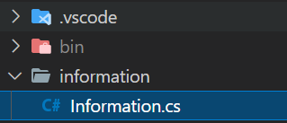

Egy törölt fájl visszaállítását mutatom most be Git verziókezelő segítségével. A szituáció az alábbi: van egy Information.cs fájlom, ami egy information mappában található. Én ezt törlöm, majd commit és push a változtatásnak.

<figure>



<figcaption>

A visszaáállítandó fájl

</figcaption>

</figure>

Amire szűkségünk lesz az annak commitnak az azonosítója, amivel a törlést beadtuk. Ezt könnyen megszerezhetünk az alábbi utasítással:

```powershell
git rev-list -n 1 --format=oneline HEAD  -- information/Information.cs

509c089cd4e6c5628a2558f83ed97790efee5552 delete information file
```

A -n paraméterrel adom meg, hogy mennyi eredményt kapjak meg --format=online segítségével meg nem csak a hasht, hanem a commit nevét megkapom. Persze a fenti példához kell, hogy tudjuk a fájlunk korábbi helyét. A lényeg, hogy valamilyen módon megszerezzük a szükséges azonosítót. Miután ez megvan nincs más hátra mint, hogy elkérjük a verziókezelőtöl, azt az állapotát, amikor még megvolt. Ehhez a checkout utasítást fogom használni.

```powershell
git checkout 509c089cd4e6c5628a2558f83ed97790efee5552^ -- information/Information.cs
```

Amire fontos figyelni, az a kis kalap jel a hash végén. Annak segítségével jelezzük, hogy nem az adott commitból kérjük le a fájlt (annak a commitnak már nem része, hiszen töröltük), hanem a szülőjétől (a korábbiból). Innentől már nincs is más dolgunk, csak annyi, hogy újra beadjuk a fájlt.


