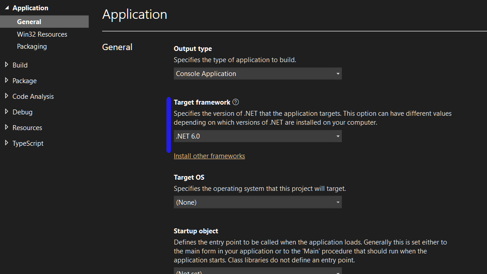

Most, hogy megjelent a .NET 6 érdemes a folyamatban lévő, vagy meglévő .NET 5-ös projektek migrálásán elgondolkodni. Nézzük meg mivel is jár ez valójában!

## Projekt file (csproj)

Az ötös projektek esetén is már a meglévő SDK projekt fájl van. Ennek elején az itt látható bejegyzés található.

```xml
<Project Sdk="Microsoft.NET.Sdk.Web">

  <PropertyGroup>
    <TargetFramework>net5.0</TargetFramework>
  </PropertyGroup>
   ...

</Project>
```

Igazából az egyetlen fontos dolog, amin változtatni kell, hogy a TargetFramework értékét kell átírni net6.0 értékre. És igen ennyi az egész! **Amire még szükség lehet az a használt csomagok frissítése.** Én még hozzá tettem az ImplicitUsings és a nullable referenciák használatának bekapcsolását.

```xml
<Project Sdk="Microsoft.NET.Sdk.Web">
	
	<PropertyGroup>
		<TargetFramework>net6.0</TargetFramework>
		<ImplicitUsings>enable</ImplicitUsings>
		<Nullable>enable</Nullable>
	</PropertyGroup>
	...

</Project>
```

A target framework beállítás még a projecten jobb klikk Propertiesre kattintás után is megváltoztatható:



## Továbbiak (program.cs és startup.cs)

Ez a lépés teljesen opcionális már. A korábbi hosting model továbbra is támogatott! Az új hosting modellnek (minimal hosting model) köszönhetően nem kell feltétlenül két osztály ahhoz, hogy a webalkalmazásunkat működésre bírjuk. A kódmennyiség csökkentésében még segítségünkre lesz a top-level statements és a global using (a korábban beállított implicit usings használatával). Ezekkel könnyen egyesíthetjük a program.cs és startap.cs fájlunkat és terjedelemre is kisebb lesz. Bemásoltam ide egy példa projekt két említett fájljának tartalmát:

```csharp
public class Program
{
    public static void Main(string[] args)
    {
        CreateHostBuilder(args).Build().Run();
    }

    public static IHostBuilder CreateHostBuilder(string[] args) =>
        Host.CreateDefaultBuilder(args)
            .UseServiceProviderFactory(new AutofacServiceProviderFactory())
            .ConfigureWebHostDefaults(webBuilder =>
            {
                webBuilder.UseStartup<Startup>()
                .UseSerilog((hostContext, loggerConfiguration) =>
                {
                    loggerConfiguration.ReadFrom.Configuration(hostContext.Configuration, "ExampleApiProjectLogging");
                });
            });
}
```

```csharp
public class Startup
{
    public ILifetimeScope AutofacContainer { get; private set; }

    public Startup(IConfiguration configuration)
    {
        Configuration = configuration;
    }

    public IConfiguration Configuration { get; }

    public void ConfigureServices(IServiceCollection services)
    {

        services.AddControllers();
        services.AddSwaggerGen(c =>
        {
            c.SwaggerDoc("v1", new OpenApiInfo { Title = "Example.ApiProject", Version = "v1" });
        });
        services.AddDbContext<ExampleApiProjectDbContext>(options =>
        {
            options.UseSqlServer(
                Configuration.GetConnectionString("ExampleApiProjectConnection"),
                sqlOptions => sqlOptions.MigrationsHistoryTable("__EFMigrationsHistory", "dbo")
            );
        });
    }

    public void Configure(IApplicationBuilder app, IWebHostEnvironment env)
    {
        app.UseMiddleware<ExceptionHandlerMiddleware>();

        if (env.IsDevelopment())
        {
            app.UseDeveloperExceptionPage();
            app.UseSwagger();
            app.UseSwaggerUI(c => c.SwaggerEndpoint("/swagger/v1/swagger.json", "Example.ApiProject v1"));

            app.UseCors(
                options => options.WithOrigins("http://localhost:4200")
                .AllowAnyMethod()
                .AllowAnyHeader()
                .AllowCredentials()
            );
        }

        app.UseHttpsRedirection();
        app.UseRouting();
        app.UseAuthorization();

        app.UseEndpoints(endpoints =>
        {
            endpoints.MapControllers();
        });

        if (env.IsDevelopment())
        {
            app.UseSpa(spa =>
            {
                spa.UseProxyToSpaDevelopmentServer("http://localhost:4200");
            });
        }
        else
        {
            app.UseDefaultFiles();
            app.UseSpaStaticFiles();
        }
        AutofacContainer = app.ApplicationServices.GetAutofacRoot();
    }

    public void ConfigureContainer(ContainerBuilder builder)
    {
        builder.RegisterModule(new ExampleApiProjectModule());
    }
}
```

Ezek összesen usingok nélkül is 95 sort tettek ki, usingokkal 100 felett van összesen. Alakítsuk át az új formára és nézzük meg mi lesz belőle.

Pár információ még előtte:

- A szolgáltatásokat a WebApplicationBuilder Services tulajdonságán keresztül tudjuk beregisztrálni
- Az alkalmazás konfigurációkat a builder Configuration tulajdonságon keresztül tudjuk olvasni
- Végül a WebApplication maga pedig a buildelés után válik elérhetővé, ezt használva tudunk hozzáférni a pipeline-hoz

Elsőnek a program.cs fájlt alakítsuk át:

```
var builder = WebApplication.CreateBuilder(args);

builder.Host.UseServiceProviderFactory(new AutofacServiceProviderFactory());
builder.Host.ConfigureContainer<ContainerBuilder>(builder => builder.RegisterModule(new ExampleApiProjectModule()));
builder.Host.UseSerilog((hostContext, loggerConfiguration) =>
{
    loggerConfiguration.ReadFrom.Configuration(hostContext.Configuration, "ExampleApiProjectLogging");
});

var startup = new Startup(builder.Configuration);
startup.ConfigureServices(builder.Services);

var app = builder.Build();

startup.Configure(app, app.Environment);

app.Run();
```

A top-level statements miatt nem szükséges névtér és osztály neki, szóval csak szabadon lehet script szerűen írni a kódot. Ezután amennyiben szeretnénk akár a startup osztályban található kódokat is átemelhetjük és akkor egy ilyen eredményt kapunk:

```csharp
using Autofac;
using Autofac.Extensions.DependencyInjection;
// ...
using Microsoft.EntityFrameworkCore;
using Microsoft.OpenApi.Models;
using Serilog;

var builder = WebApplication.CreateBuilder(args);

builder.Host.UseServiceProviderFactory(new AutofacServiceProviderFactory());
builder.Host.ConfigureContainer<ContainerBuilder>(builder => builder.RegisterModule(new ExampleApiProjectModule()));
builder.Host.UseSerilog((hostContext, loggerConfiguration) =>
{
    loggerConfiguration.ReadFrom.Configuration(hostContext.Configuration, "ExampleApiProjectLogging");
});

builder.Services.AddControllers();
builder.Services.AddSwaggerGen(c =>
{
    c.SwaggerDoc("v1", new OpenApiInfo { Title = "Example.ApiProject", Version = "v1" });
});

var connectionString = builder.Configuration.GetConnectionString("ExampleApiProjectConnection");
builder.Services.AddDbContext<ExampleApiProjectDbContext>(options =>
{
    options.UseSqlServer(
        connectionString,
        sqlOptions => sqlOptions.MigrationsHistoryTable("__EFMigrationsHistory", "dbo")
    );
});

var app = builder.Build();
    app.UseMiddleware<ExceptionHandlerMiddleware>();

if (app.Environment.IsDevelopment())
{
    app.UseDeveloperExceptionPage();
    app.UseSwagger();
    app.UseSwaggerUI(c => c.SwaggerEndpoint("/swagger/v1/swagger.json", "Example.ApiProject v1"));

    app.UseCors(
        options => options.WithOrigins("http://localhost:4200")
        .AllowAnyMethod()
        .AllowAnyHeader()
        .AllowCredentials()
    );
}

app.UseHttpsRedirection();
app.UseRouting();
app.UseAuthorization();

app.UseEndpoints(endpoints =>
{
    endpoints.MapControllers();
});

if (app.Environment.IsDevelopment())
{
    app.UseSpa(spa =>
    {
        spa.UseProxyToSpaDevelopmentServer("http://localhost:4200");
    });
}
else
{
    app.UseDefaultFiles();
    app.UseSpaStaticFiles();
}

app.Run();
```

Kaptunk egy 70+ soros fájlt using résszel együtt, viszont most minden ömlesztve van kissé. Lehet még finomítani a dolgon meg az sem biztos, hogy mindenkinek ilyen nagy a startup része. Ez már ízlés kérdése, hogy kinek melyik változat tetszik jobban.
