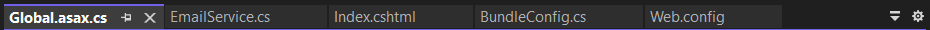
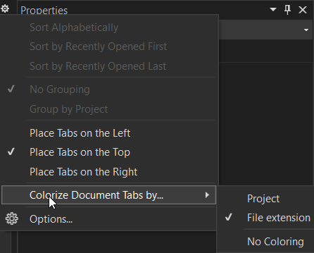
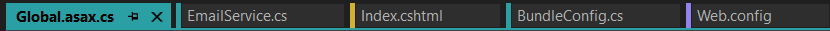
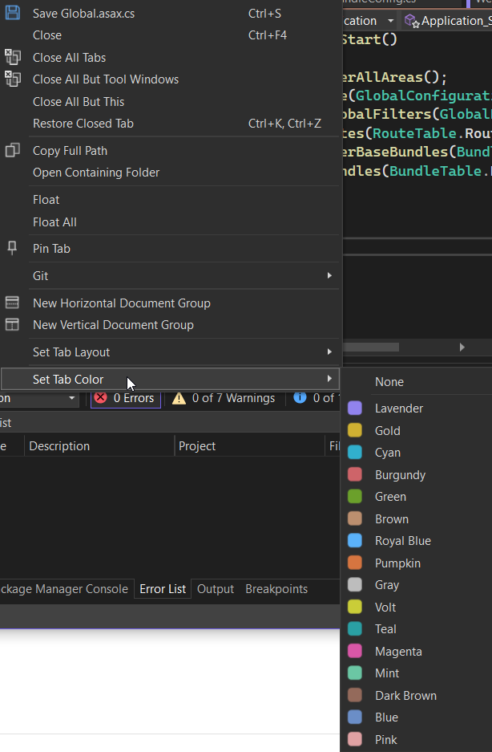
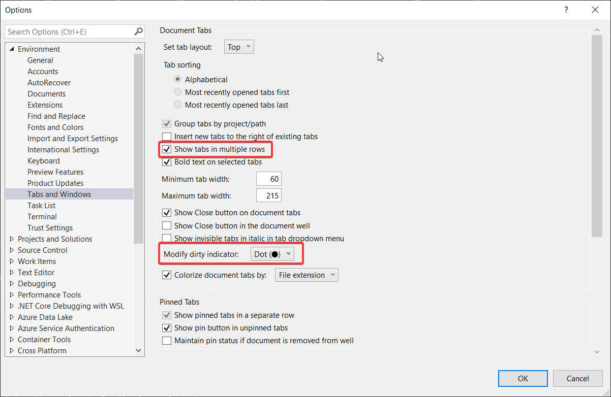
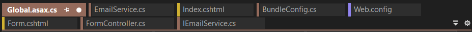

A Visual Studio 2022 képességei folyamatosan fejlődnek, még az olyan apró részén is mint a tabok. Alapértelmezetten szürke egy sorban elhelyezkedő füleket láthatunk, a végén egy kis lenyílóval.

Ez teljesen jól működő megoldás, de van lehetőségünk kicsit személyre szabni. A sor végén található egy fogaskerék is, amire kattintva feljön egy menü innen rögtön könnyedén színezhetjük a tabokat, így megkülönböztetve őket egymástól. Itt két lehetőségünk van, projektenként, vagy fájlkiterjesztésenként legyen nekik külön színük.

Az eredmény pedig így néz ki:

A hozzá rendelt színeket kedvünkre megváltoztathatjuk úgy, hogy bármelyik fülön jobb egérgomb után a feljövő menüben a Set Tab Color elemnél megjelentek közül választunk egy kedvünkre valót.

Nincs minden tabokkal kapcsolatos beállítás kitéve a gyors elérések közé, ezért érdemes benézni a részletes beállításokhoz. Ezt legegyszerűbben a már említett fogaskerékre kattintva feljövő menüből az Options... elemet kiválasztva tudjuk megtenni. Innen két beállítást emelnék ki az egyik a Show tabs in multiple rows, a másik pedig a Modify dirty indicator.

Az első bekapcsolásával több sorba tehetjük a tabokat, a másodikkal, pedig a nem mentett fájlok esetén a \* helyet egy nagyobb pöttyöt kapunk a fülre (ez szerintem figyelemfelkeltőbb).

Természetesen az teljesen ízlés kérdése, hogy kinek mennyire tetszenek ezek a dolgok, de talán érdemes egy próbát tenni vele.
