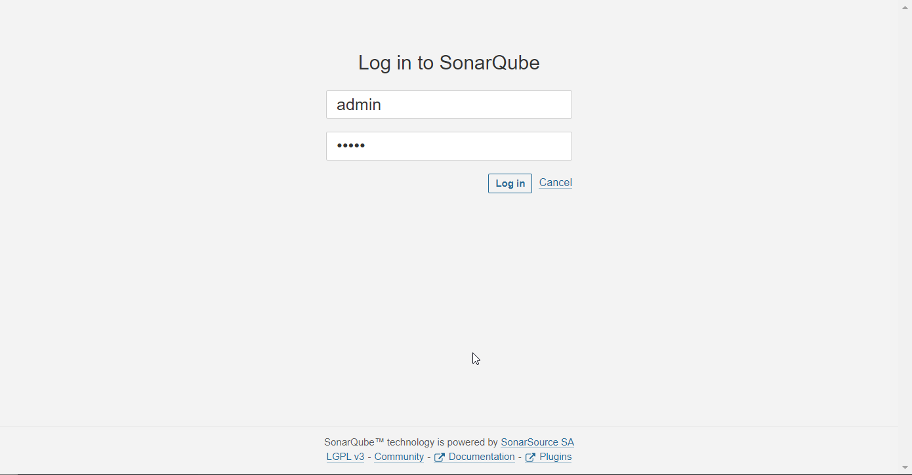
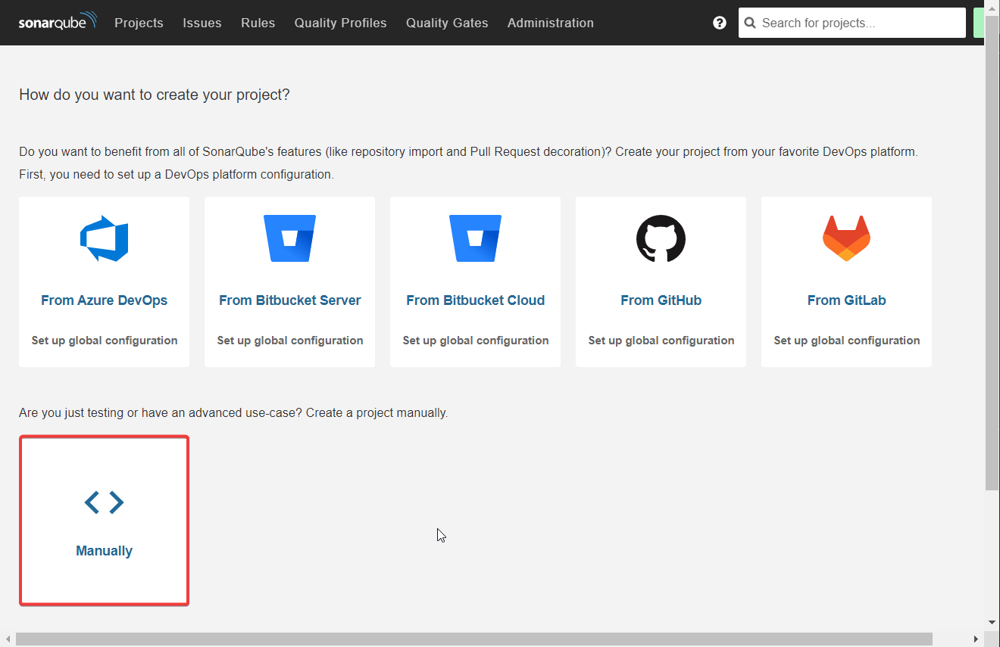
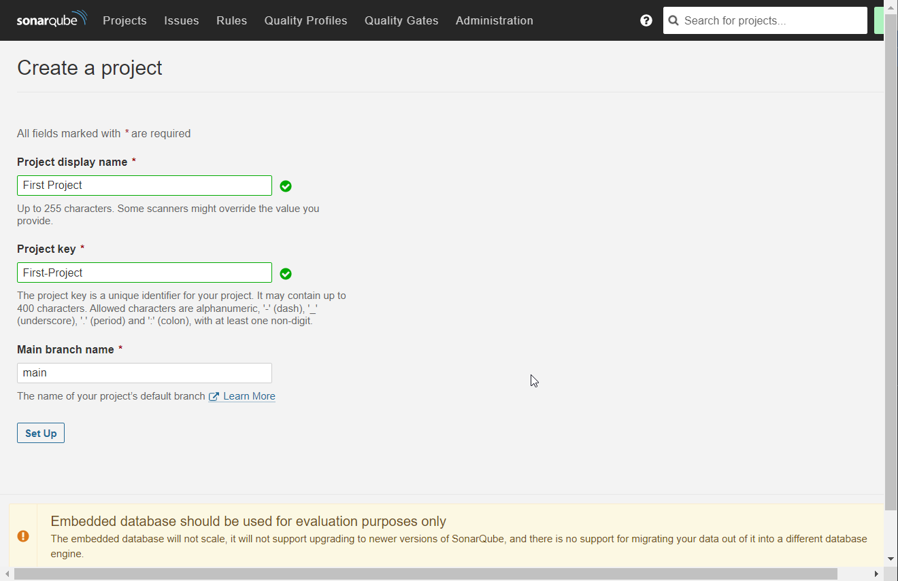
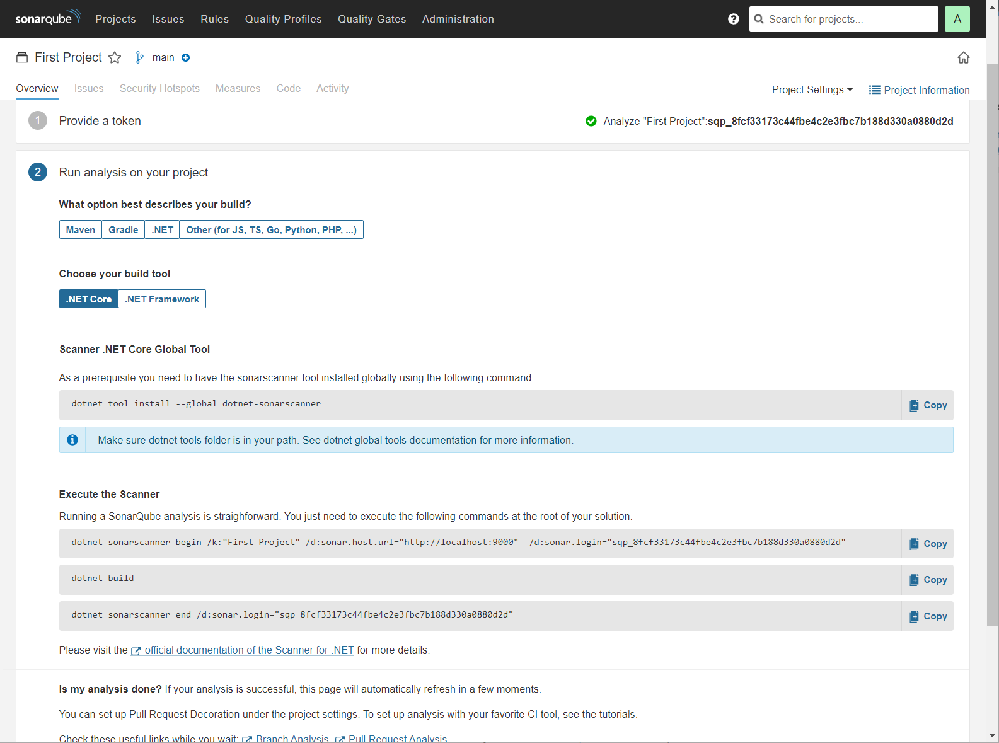
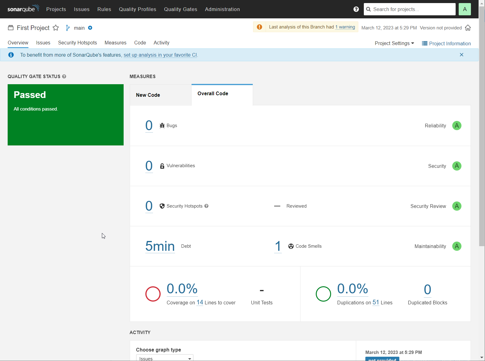

## SonarQube

A SonarQube egy kód ellenőrző eszköz, ami a kód minőségéről ad információkat. Például mennyi bug, code smell, sérülékenység, stb. található egy projektben. Hobbi projekthez is kiválóan használható, különösen azért, mert a community verzió teljesen ingyenes. A konténerben futtatott verzió, pedig azért is lehet, hasznos, mert átmozgathatjuk másik gépre, lekapcsolhatjuk ha éppen nincs rá szükségünk, vagy limitálhatjuk a konténer számára rendelkezésre álló erőforrásokat.

## Készítsük el a containert

Először is töltsük le magát az image-t:

```powershell
docker pull sonarqube:9.9-community
```

Az alábbi paramétereket használva készítsünk egy containert:

```powershell
docker run -d --name sonarqube -p 9000:9000 -p 9092:9092 --memory="2G" --cpus="2" -v C:\work\sonarqube\data:/opt/sonarqube/data -v C:\work\sonarqube\logs:/opt/sonarqube/logs -v C:\work\sonarqube\extensions:/opt/sonarqube/extensions sonarqube:9.9-community 
```

Nézzük sorra a paramétereket:  
\\-d: detached módban indítjuk a containert (nem csatlakozunk rá a terminállal)  
\\--name: a container neve  
\\-p: portok mappelése  
\\--memory: használható memória  
\\--cpus: használható processzor erőforrás (mag) száma  
\\-v: a mappelt mappák \{helyi elérési útja\}:\{containerben elérés útja\} (így megmaradnak az adatok)

Ezt lefuttatva nincs más dolgunk mint elnavigálni a megadott címre és első alkalommal egy admin (alapértelmezetten admin) jelszó megváltoztatása után a projektet létrehozni és az ott kapott azonosítót felírni.









## .NET Projekt vizsgálata:

Telepítsük a sonarscannert az alábbi sor lefuttatásával:

```powershell
dotnet tool install --global dotnet-sonarscanner
```

Végül az alábbi utasításokat használva eljuttatjuk a SonarQube-nak az adatokat (token generálása után a felületről másolható):

```powershell
dotnet sonarscanner begin /k:"First-Project" /d:sonar.host.url="http://localhost:9000"  /d:sonar.login="{kapott azonosító}"

dotnet build

dotnet sonarscanner end /d:sonar.login="{kapott azonosító}"
```

Ezután a projekt oldalán már látható lesz az elemzés eredménye:



Nem maradt más hátra, mint megnézni mi mindent talált nekünk a SonarQube.

## Opcionális/további lehetőségek

### Adatbázis szerver beállítása

Az egyik képen látható egy figyelmeztetés, hogy a beágyazott (H2 adatbázis) használata esetén bizonyos problémákba ütközhetünk, amennyiben újabb SonarQube verzióra szeretnénk váltani, vagy migrálni szeretnénk adatainkat. Ennek megoldásaként lehetőségünk van az alábbi környezeti változók beállításával csatlakozni (például egy ms sql) adatbázis szerverhez.

```powershell
SONAR_JDBC_URL="jdbc:sqlserver://172.19.0.2:1433;databaseName=sonar;trustServerCertificate=true"
SONAR_JDBC_USERNAME=sonardb
SONAR_JDBC_PASSWORD=Admin1234
```

Ilyenkor a teljes utasítás így néz ki:

```powershell
docker run -d --name sonarqube -p 9000:9000 -p 9092:9092 --memory="2G" --cpus="2" -e SONAR_JDBC_URL="jdbc:sqlserver://172.19.0.2:1433;databaseName=sonar;trustServerCertificate=true" -e SONAR_JDBC_USERNAME=sonardb -e SONAR_JDBC_PASSWORD=Admin1234 -v C:\work\sonarqube\data:/opt/sonarqube/data -v C:\work\sonarqube\logs:/opt/sonarqube/logs -v C:\work\sonarqube\extensions:/opt/sonarqube/extensions sonarqube:9.9-community
```

### Limit átállítása

Az adatbázis elérés kunfigurálása után, indításnál kaphatunk egy ilyen hibaüzenetet: _Max virtual memory areas vm.max\_map\_count \[65530\] is too low, increase to at least \[262144\]_ (Amikor a beépített H2 adatbázissal próbáltam, akkor nem jelentkezett a probléma.)  
Ilyenkor, amit tenni tudunk:

1) Teljesítjük a kérését és megemeljük a limitet. Windows wsl2 megoldás:

```powershell
wsl -d docker-desktop
sysctl -w vm.max_map_count=262144
exit
```

Ezzel a megoldással csak az a gond, hogy újraindítás után ismételten le kell futtatni a beállítást.

2\. Lekapcsoljuk az indításkor történő elastic ellenőrzését. Ezt úgy tudjuk megtenni, hogy egy környezeti változót beállítunk.

SONAR\_ES\_BOOTSTRAP\_CHECKS\_DISABLE=true

### Docker compose

Abban az esetben, ha szeretnénk docker compose fájlban használni, akkor a korábbi utasításnak a megfelelője itt látható:

```yaml
version: '3.3'
services:
    sonarqube:
        container_name: sonarqube
        ports:
            - '9000:9000'
            - '9092:9092'
        environment:
            - 'SONAR_JDBC_URL=jdbc:sqlserver://172.19.0.2:1433;databaseName=sonar;trustServerCertificate=true'
            - SONAR_ES_BOOTSTRAP_CHECKS_DISABLE=true
            - SONAR_JDBC_USERNAME=sonardb
            - SONAR_JDBC_PASSWORD=Admin1234
        volumes:
            - 'C:\work\sonarqube\data:/opt/sonarqube/data'
            - 'C:\work\sonarqube\logs:/opt/sonarqube/logs'
            - 'C:\work\sonarqube\extensions:/opt/sonarqube/extensions'
        image: 'sonarqube:9.9-community'
```
