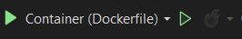

A Visual Studio 2022 segítségével könnyen készíthetünk docker filet ASP .NET Core alkalmazásunkhoz. Ehhez csak jobb klikk a projekten add menüpont majd Docker Support kiválasztása. Ez elkészíti a docker fájlunkat és elhelyez egy containeres futtatáshoz szükséges bejegyzést a launchSettings.json fájlban (és kapunk egy .dockerignore fájlt is, de ez most nem lényeges). Ezután már fent a menüsorban kiválasztható, hogy a projektet konténert használva szeretnénk indítani.



Debugban elindítva működik a breakpoint elhelyezés és könnyen felmerülhet a kérdés, hogy de miért is van ez így, amikor a dockerfileban nincs semmi, ami ezt indokolná. A megoldás természetesen nem bonyolult és ahogyan sejteni lehet a docker run paraméterek között lesz a megoldás. Az említett esetben az alábbi docker run utasítás hajtódik végre:

``` powershell 
docker run -dt -v "C:\Users\*****\vsdbg\vs2017u5:/remote_debugger:rw" 
-v "C:\Users\*****\AppData\Roaming\Microsoft\UserSecrets:/root/.microsoft/usersecrets:ro" 
-v "C:\Users\*****\AppData\Roaming\Microsoft\UserSecrets:/home/app/.microsoft/usersecrets:ro" 
-v "C:\Users\*****\AppData\Roaming\ASP.NET\Https:/root/.aspnet/https:ro" 
-v "C:\Users\*****\AppData\Roaming\ASP.NET\Https:/home/app/.aspnet/https:ro" 
-v "C:\Program Files\Microsoft Visual Studio\2022\Enterprise\MSBuild\Sdks\Microsoft.Docker.Sdk\tools\TokenService.Proxy\linux-x64\net6.0:/TokenService.Proxy:ro" 
-v "C:\Program Files\Microsoft Visual Studio\2022\Enterprise\MSBuild\Sdks\Microsoft.Docker.Sdk\tools\HotReloadProxy\linux-x64\net8.0:/HotReloadProxy:ro" 
-v "C:\Program Files\Microsoft Visual Studio\2022\Enterprise\Common7\IDE\CommonExtensions\Microsoft\HotReload:/HotReloadAgent:ro" 
-v "C:\work\ExampleApi\src\ ExampleApi.QueryApi:/app" 
-v "C:\work\ ExampleApi \src:/src/" 
-v "C:\Users\*****\.nuget\packages\:/.nuget/fallbackpackages2" 
-v "C:\Program Files (x86)\Microsoft Visual Studio\Shared\NuGetPackages:/.nuget/fallbackpackages" 
-e "ASPNETCORE_LOGGING__CONSOLE__DISABLECOLORS=true" 
-e "ASPNETCORE_ENVIRONMENT=Development" -e "DOTNET_USE_POLLING_FILE_WATCHER=1" 
-e "NUGET_PACKAGES=/.nuget/fallbackpackages2" 
-e "NUGET_FALLBACK_PACKAGES=/.nuget/fallbackpackages;/.nuget/fallbackpackages2" 
-P --name ExampleApi.QueryApi --entrypoint tail exampleapiqueryapi:dev -f /dev/null
```

Ezt a build output ablakban lehet megtalálni. A lényeg, hogy azért működik a debug és a hot reloaded, mert ilyenkor nem csak egy egyszerű docker run történik hanem volume paraméterek formájában felcsatol minden szükséges mappát ehhez.

Ezeket a paramétereket módosítani (a bejegyzés írásának pillanatában, ha jól tudom) nem lehet, de továbbiakat hozzá lehet adni. Ezt legkönnyebben úgy tehetjük meg, hogy a launchSettings.json fájlt megnyitjuk és egy dockerfileRunArguments tulajdonságban megadjuk a docker run paramétereket, amiket használni szeretnénk.

``` json
"DEBUG Container (Dockerfile)": {
  "commandName": "Docker",
  "launchBrowser": true,
  "launchUrl": "{Scheme}://{ServiceHost}:{ServicePort}/swagger",
  "environmentVariables": {
    "ASPNETCORE_HTTPS_PORTS": "8081",
    "ASPNETCORE_HTTP_PORTS": "8080"
  },
  "dockerfileRunArguments": " -v ExampleApiAdditionalFilesVolume:/ExampleApiAdditionalFiles",
  "publishAllPorts": true,
  "useSSL": true
}
```

A példában egy létrehozott volume van megadva, de akár más, vagy további paramétereket is megadhatunk. Ezeket az entrypoint paraméter elé fogja beszúrni. Innentől kezdve már csak rajtunk múlik mit szeretnénk.
