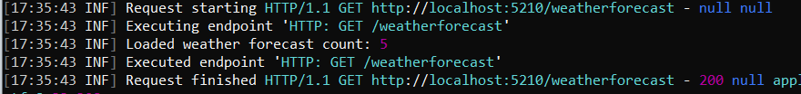
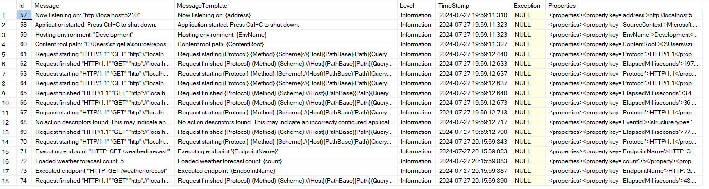
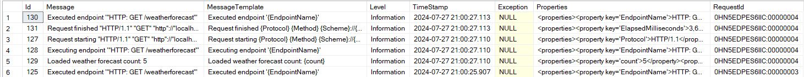

A Serilog csomagot sokan ismerhetik. Röviden, a fő jellemzője a strukturált naplózás, amelynek köszönhetően könnyebben kereshetőek és elemezhetőek a naplóbejegyzések (adatok). Számos naplózási helyet (sink) támogat, mint például fájl, konzol, adatbázis, stb. Jól dokumentált és rengeteg tudásanyag és csomag található hozzá a neten. Ebben az írásban MSSQL adatbázisba történő naplózás konfigurálását szeretném bemutatni Serilog használatával.

## Serilog hozzáadása a projekthez

Kiindulási pontnak az alap asp.net core web api projektet veszem. Első lépésnek adjuk hozzá a szükséges NuGet csomagokat a projektünkhöz:

```
Serilog
Serilog.AspNetCore
```

A program.cs fájlba vegyük fel az alábbiakat:

``` csharp
Log.Logger = new LoggerConfiguration()
        .WriteTo.Console()
        .CreateLogger();

builder.Services.AddSerilog();
```

Még vegyünk fel egy naplózást a jól ismert weatherforecast végponthoz tartozó metóduunkba:

```
app.MapGet("/weatherforecast", (ILogger<Program> logger) =>
{
    var forecast = Enumerable.Range(1, 5).Select(index =>
        new WeatherForecast
        (
            DateOnly.FromDateTime(DateTime.Now.AddDays(index)),
            Random.Shared.Next(-20, 55),
            summaries[Random.Shared.Next(summaries.Length)]
        ))
        .ToArray();

    logger.LogInformation("Loaded weather forecast count: {count}",forecast.Length);

    return forecast;
})
.WithName("GetWeatherForecast")
.WithOpenApi();
```



A kód futtatása után a fenti eredmény látható. Most már működik is a Console-ra naplózás.

## Adatbázis naplózás beállítása

Ahhoz, hogy adatbázisba is működjön a naplózás a megfelelő sink csomagra lesz szükség. A példában Microsoft SQL Server adatbázist fogom megmutatni, ezért az alábbi csomagra lesz szükség:

```
Serilog.Sinks.MSSqlServer
```

Szükségünk lesz ezenkívül egy adatbázis táblára, ahova naplózhatunk. Ez megtalálható a sink github oldalán is.

```
CREATE TABLE [Logs] (

   [Id] int IDENTITY(1,1) NOT NULL,
   [Message] nvarchar(max) NULL,
   [MessageTemplate] nvarchar(max) NULL,
   [Level] nvarchar(128) NULL,
   [TimeStamp] datetime NOT NULL,
   [Exception] nvarchar(max) NULL,
   [Properties] nvarchar(max) NULL

   CONSTRAINT [PK_Logs] PRIMARY KEY CLUSTERED ([Id] ASC)
);
```

Lehetőség van ezt automatikusan is létrehozni a sinkOptions AutoCreateSqlTable beállítással.

Már csak a konfiguráció van hátra, és készen is vagyunk. Bővítsük ki a korábban megírt részt, hogy az alábbi eredményt lássuk:

```
Log.Logger = new LoggerConfiguration()
        .WriteTo.Console()
        .WriteTo.MSSqlServer(
            connectionString: builder.Configuration.GetConnectionString("LogDbConnectionString"),
            sinkOptions: new MSSqlServerSinkOptions { TableName = "Logs" })
        .CreateLogger();
```

Futtasuk az alkalmazást, hívjuk meg a végpontot és ha minden jól lett beállítva akkor a lenti képhez hasonló eredmény lesz látható a táblában.



## További oszlopok hozzáadása

Kiindulásnak nem rossz a fenti eredmény, de előfordulhat, hogy szeretnénk valamilyen logban található property-t kiemelni egy oszlopba. Nézzük meg ennek a lehetőségét.

Vegyük példának a request id tulajdonságot. Először az SQL táblánkat bővítsük ki az alábbi scripttel.

```
ALTER TABLE dbo.Logs ADD
	RequestId nvarchar(36) NULL
```

Még a Serilog beállításainkat szükséges módosítani. Az adatbázis tábla szerkezetének változtatásához columnOptions megfelelő paraméterezése szükséges.

```
Log.Logger = new LoggerConfiguration()
        .WriteTo.Console()
        .WriteTo.MSSqlServer(
            connectionString: builder.Configuration.GetConnectionString("LogDbConnectionString"),
            sinkOptions: new MSSqlServerSinkOptions { TableName = "Logs" },
            columnOptions: new ColumnOptions()
            {
                AdditionalColumns = 
                [
                    new SqlColumn("RequestId",System.Data.SqlDbType.NVarChar,dataLength: 36)
                ]
            })
        .CreateLogger();
```



Az egész úgy működik, hogy amennyiben a property neve megegyezik a column nevével, akkor a fent látható módon tudja tölteni. Abban az esetben, ha a kettő eltér, akkor sincs probléma, csupán az a fontos, hogy a SqlColumn objektumunk PropertyName tulajdonsága is ki legyen töltve. Innentől kezdve bármi, ami bekerül a properties közé, akár külön oszlopba is tehetün. Az enricherekkel kombinálva bármilyen információt kirakhatunk.

Érdemes még két beállítást megemlíteni az addStandardColumns és a removeStandardColumns lehetőségeket. A nevükből adódóan a "gyári" adatok hozzáadása és elvétele lehetséges. Ebből nézzük meg a LogEvent hozzáadását, ami azért fontos, mert ennek segítségével JSON formában is tároljuk az adatokat. Ez azért lehet hasznos, mert az SQL Server 2016 verzió óta vannak JSON függvények, amik a keresést lekérdezést egy napló táblában megkönnyíthetik.

Megint előszőr a táblát módosítsuk.

```
ALTER TABLE dbo.Logs ADD
	LogEvent nvarchar(MAX) NULL
```

Utána meg a konfigurációs kódunkat, némileg átalakítva a korábbihoz képest.

```
var columnOptions = new ColumnOptions()
{
    AdditionalColumns = [
                    new SqlColumn("RequestId",System.Data.SqlDbType.NVarChar,dataLength: 36)
                ]
};

columnOptions.Store.Add(StandardColumn.LogEvent);

Log.Logger = new LoggerConfiguration()
        .WriteTo.Console()
        .WriteTo.MSSqlServer(
            connectionString: builder.Configuration.GetConnectionString("LogDbConnectionString"),
            sinkOptions: new MSSqlServerSinkOptions { TableName = "Logs" },
            columnOptions: columnOptions)
        .CreateLogger();
```

Az adatbázos tábla LogEvent oszlopában például ilyet láthatunk:

```
{
  "TimeStamp": "2024-07-27T21:23:02.9058589",
  "Level": "Information",
  "Message": "Loaded weather forecast count: 5",
  "MessageTemplate": "Loaded weather forecast count: {count}",
  "Properties": {
    "count": 5,
    "SourceContext": "Program",
    "RequestId": "0HN5EE62FJEAG:00000004",
    "RequestPath": "/weatherforecast",
    "ConnectionId": "0HN5EE62FJEAG"
  }
}
```

Egy valódi rendszer esetében könnyen lehet szűrni például arra, hogy a weather forecast count hol nagyobb, mint 5.

```
SELECT [Message],
	[TimeStamp],
	JSON_VALUE(LogEvent, '$.Properties.count') AS WeatherForecastCount
FROM [LogDb].[dbo].[Logs]
WHERE JSON_VALUE(LogEvent, '$.Properties.count') > 3
```

## Konfiguráció áthelyezése appsettings.json fájlba

A naplózással kapcsolatban rugalmasabbak lehetünk akkor, ha ezt az egészet áttesszük appsettings.json fájlba. A jövőben így akár forráskód módosítása nélkül is lehet változtatni a napózás beállításain. Ez a Serilog.Settings.Configuration NuGet csomag letöltésével megoldható, de mivel hivatkozik rá a Serilog.AspNetCore ezért ez a lépés kihagyható.

Módosítsuk a program.cs fájlban a Serilog beállítását:

```
Log.Logger = new LoggerConfiguration()
        .ReadFrom.Configuration(builder.Configuration)
        .CreateLogger();
```

Végül az appsettings.json fájlban rakjuk össze a korábbi beállítás megfelelőjét

```
  "Serilog": {
    "Using": [
      "Serilog.Sinks.Console",
      "Serilog.Sinks.MSSqlServer"
    ],
    "MinimumLevel": {
      "Default": "Information",
      "Override": {
        "Microsoft.AspNetCore": "Warning",
        "System": "Warning"
      }
    },
    "WriteTo": [
      {
        "Name": "Console"
      },
      {
        "Name": "MSSqlServer",
        "Args": {
          "connectionString": "LogDbConnectionString",
          "sinkOptionsSection": {
            "tableName": "Logs"
          },
          "columnOptionsSection": {
            "addStandardColumns": [
              "LogEvent"
            ],
            "additionalColumns": [
              {
                "ColumnName": "RequestId",
                "DataType": "nvarchar",
                "DataLength": 36
              }
            ]
          }
        }
      }
    ]
  }
```

A konfiguráció leírása nem tűnik feltétlenül egyszerűnek, de bármelyik csomagot is használjuk a Seriloghoz, a dokumentációja mindegyiknek rendben van. Abban az esetben, ha valamilyen kérdés merülne fel, érdemes a github oldalukat felkeresni.
