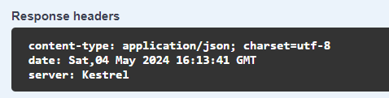

Alapértelmezetten egy Server bejegyzés kerül a response headerbe Az ASP .NET alkalmazások készításe és tesztelése során. Ez két féle módon történhet. Az egyik, hogy IIS alól futtatjuk és akkor az IIS (pipeline) teszi bele, a másik hogy az ASP .NET Core keretrendszernek köszönhetően kerül rá, amikor a Kestrelt használjuk. Ennek kiszedése sok helyen követelmény, mert információt adhat az alkalmazásról és a futtatókörnyezetről.



Kestrel esetén könnyű dolgunk van csak a WebApplicationBuilder objektumon kell az alábbi kóddal beállítani a kívánt működést:

```
builder.WebHost.ConfigureKestrel(o => o.AddServerHeader = false);
```

IIS (10+) használatakor a web.config segítségével érhetjük el a célunkat a legegyszerűbben. Ehhez az alábbi részt kell beletenni:

```
<system.webServer>
 <security>
    <requestFiltering removeServerHeader="true" />
 </security>
</system.webServer>
```
