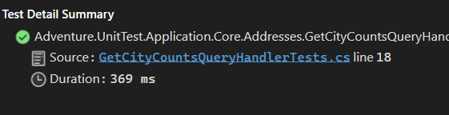
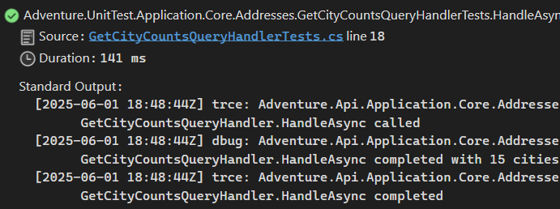

## Honnan indulunk

Nézzük az alábbi példakódot amiben az adatbázisban található címek számát lekérdezzük városonként csoportosítva. (Lehet kicsit erőltetett a példa, de most nem is ez lesz a lényeg, hanem az, hogy a képzeletbeli üzleti logikánk tartalmaz naplózásra vonatkozó kódokat.)

``` csharp
public class GetCityCountsQueryHandler(IAddressDbQuery addressDbQuery, ILogger<GetCityCountsQueryHandler> logger) : IGetCityCountsQueryHandler
{
    private readonly IAddressDbQuery _addressDbQuery = addressDbQuery;
    private readonly ILogger<GetCityCountsQueryHandler> _logger = logger;

    public async Task<GetCityCountsResult> HandleAsync(GetCityCountsQuery query, CancellationToken cancellationToken)
    {
        _logger.LogTrace(_logger.IsEnabled(LogLevel.Trace) ? "GetCityCountsQueryHandler.HandleAsync called" : string.Empty);

        List<CityAndCount> citiesWithCounts = await _addressDbQuery.CountAddressesByCitiesAsync(cancellationToken);

        GetCityCountsResult result = new()
        {
            CityAndCounts = citiesWithCounts,
            NumberOfAddresses = citiesWithCounts.Sum(c => c.count)
        };

        _logger.LogDebug(_logger.IsEnabled(LogLevel.Debug) ? "GetCityCountsQueryHandler.HandleAsync completed with {Count} cities" : string.Empty, result.NumberOfAddresses);
        _logger.LogTrace(_logger.IsEnabled(LogLevel.Trace) ? "GetCityCountsQueryHandler.HandleAsync completed" : string.Empty);

        return result;
    }

}
```

 Erre írt xUnit alapú unit test például az alábbi módon nézhet ki (a városok konkrét ellenőrzése nélkül) :

 ```csharp
[Fact]
public async Task HandleAsync_15ElementWith3CitiesInCollection_ReturnGetCityCountsResult()
{
    // Arrange
    Mock<IAddressDbQuery> addressDbQueryMock = new();
    List<CityAndCount> CityAndCountCollection = [
        new CityAndCount("Budapest", 10),
        new CityAndCount("Paris",1),
        new CityAndCount("Brno",4)
        ];
    addressDbQueryMock.Setup(a => a.CountAddressesByCitiesAsync(It.IsAny<CancellationToken>())).ReturnsAsync(CityAndCountCollection);

    ILogger<GetCityCountsQueryHandler> logger = new LoggerFactory().CreateLogger<GetCityCountsQueryHandler>();

    GetCityCountsQueryHandler getCityCountsQueryHandler = new(addressDbQueryMock.Object, logger);

    // Act
    GetCityCountsResult result = await getCityCountsQueryHandler.HandleAsync(new GetCityCountsQuery(), TestContext.Current.CancellationToken);

    // Assert
    Assert.NotNull(result);
    Assert.Equal(15, result.NumberOfAddresses);
    Assert.Equal(3, result.CityAndCounts.Count);
}
```
A teszt rendben lefut és teszi a dolgát.


## Mi is lesz a loggolással?

Amint megnézzük a Test Detail Summary ablakot látni fogjuk a teszt eredményét és hogy mennyi idő alatt is futott le, de ha érdekelne minket, hogy a logger mit is ír ki azt nem jeleníti meg. Ez azért van, mert a logger nincs rákötve az xUnit outputjára, ami a ITestOutputHelper segítségével érhető el.

Ilyenkor jön a kérdés hogy mit lehet tenni? Az egyik amire gondolni szoktak, hogy írok egy mockot az ILoggerre és majd azt fogom használni. Ez is egy járható út. Lehet írni saját kiegészítőt is az ILogger és az ILoggerProvider interfészek használatával. Én egy NuGet csomagot használok erre és ennek segítségével nem kell már ezzel foglalkozni. ( Itt jegyezném meg, hogy ha elégedet vagy más által írt megoldással egy github csillag adása semmi be sem kerül :). )

Az alábbi nuget csomagra lesz szükségünk: `  `

Miután letöltöttük nincs más hátra mint, hogy injektáljuk az ITestOutputHelper intrefészt és átírjuk logger példány előállítását, ami után az alábbi módon fog kinézni a korábban megmutatott teszt kódja:

``` csharp
```

Most már a tesztet megfuttatva a teszt output ablakában látunk mindent.


