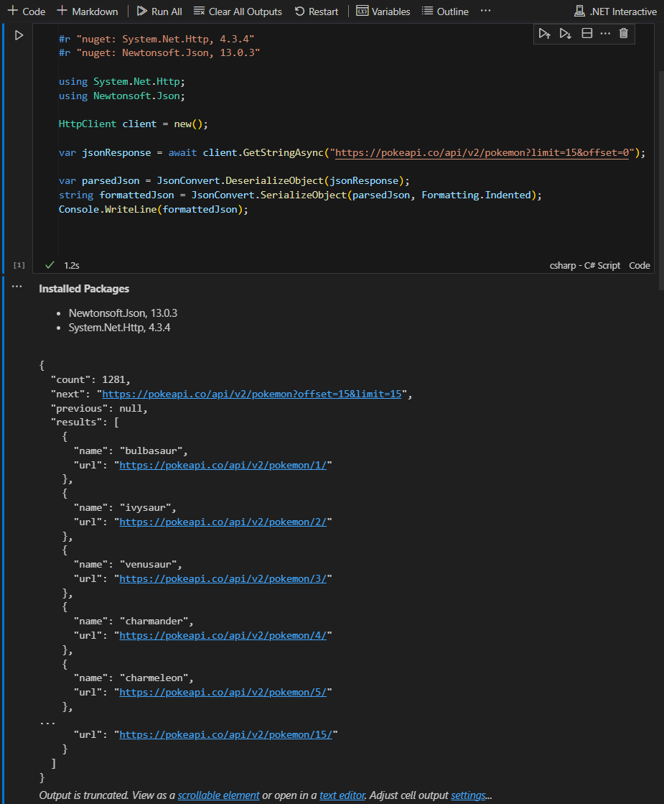

A .NET Interactive-nak köszönhetően Polyglot notebook kódblokkjaiban lehet C# nyelvet választani. Amire szükségünk van az a Visual Studio Code és a hozzá tartozó Polyglot Notebooks Extension és minimum .NET 7 SDK (az aktuális előfeltételek az extension leírásában megtalálhatóak).

Egy ilyen cellában API hívást is implementálhatunk, ehhez nem kell mást tennünk mint a System.Net.Http nuget csomagot behivatkozni és utána használhatóvá válik a HttpClient osztályt.  
A nuget csomag behivatkozásához a következő sorra van szükség: **#r "nuget: System.Net.Http, 4.3.4"**

Az alábbi kód a pokeapi hívását és a json eredmény formázott kiírására egy példa:

```csharp
#r "nuget: System.Net.Http, 4.3.4"
#r "nuget: Newtonsoft.Json, 13.0.3"

using System.Net.Http;
using Newtonsoft.Json;

HttpClient client = new();

var jsonResponse = await client.GetStringAsync("https://pokeapi.co/api/v2/pokemon?limit=15&offset=0");

var parsedJson = JsonConvert.DeserializeObject(jsonResponse);
string formattedJson = JsonConvert.SerializeObject(parsedJson, Formatting.Indented);
Console.WriteLine(formattedJson);
```

Végül az alábbi képen látható, hogy a kódblokk és az output hogyan néz ki Visual Studio Code-ban:


