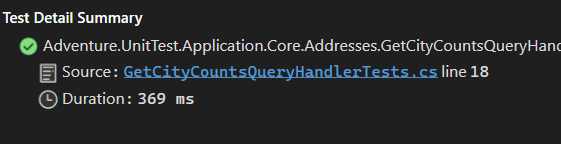
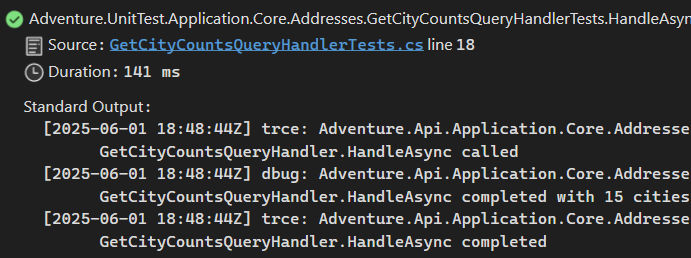

## Honnan indulunk

Nézzük meg az alábbi példakódot, amelyben az adatbázisban található címek számát városonként csoportosítva kérdezzük le. (Lehet, hogy kissé erőltetett a példa, de most nem is ez lesz a lényeg, hanem az, hogy a képzeletbeli üzleti logikánk tartalmaz naplózásra vonatkozó kódokat.)

``` csharp
public class GetCityCountsQueryHandler(IAddressDbQuery addressDbQuery, ILogger<GetCityCountsQueryHandler> logger) : IGetCityCountsQueryHandler
{
    private readonly IAddressDbQuery _addressDbQuery = addressDbQuery;
    private readonly ILogger<GetCityCountsQueryHandler> _logger = logger;

    public async Task<GetCityCountsResult> HandleAsync(GetCityCountsQuery query, CancellationToken cancellationToken)
    {
        _logger.LogTrace("GetCityCountsQueryHandler.HandleAsync called");

        List<CityAndCount> citiesWithCounts = await _addressDbQuery.CountAddressesByCitiesAsync(cancellationToken);

        GetCityCountsResult result = new()
        {
            CityAndCounts = citiesWithCounts,
            NumberOfAddresses = citiesWithCounts.Sum(c => c.count)
        };

        _logger.LogDebug("GetCityCountsQueryHandler.HandleAsync completed with {Count} cities", result.NumberOfAddresses);
        _logger.LogTrace("GetCityCountsQueryHandler.HandleAsync completed");

        return result;
    }

}
```

 Az ehhez tartozó xUnit alapú unit test például így nézhet ki (a városok konkrét ellenőrzése nélkül):

 ```csharp
[Fact]
public async Task HandleAsync_15ElementWith3CitiesInCollection_ReturnGetCityCountsResult()
{
    // Arrange
    Mock<IAddressDbQuery> addressDbQueryMock = new();
    List<CityAndCount> CityAndCountCollection = [
        new CityAndCount("Budapest", 10),
        new CityAndCount("Paris",1),
        new CityAndCount("Brno",4)
        ];
    addressDbQueryMock.Setup(a => a.CountAddressesByCitiesAsync(It.IsAny<CancellationToken>())).ReturnsAsync(CityAndCountCollection);

    ILogger<GetCityCountsQueryHandler> logger = new LoggerFactory().CreateLogger<GetCityCountsQueryHandler>();

    GetCityCountsQueryHandler getCityCountsQueryHandler = new(addressDbQueryMock.Object, logger);

    // Act
    GetCityCountsResult result = await getCityCountsQueryHandler.HandleAsync(new GetCityCountsQuery(), TestContext.Current.CancellationToken);

    // Assert
    Assert.NotNull(result);
    Assert.Equal(15, result.NumberOfAddresses);
    Assert.Equal(3, result.CityAndCounts.Count);
}
```

A teszt rendben lefut és a várt eredményt adja.



## Mi történik a naplózással?

Amint megnézzük a **Test Detail Summary** ablakot, láthatjuk a teszt eredményét és azt is, hogy mennyi idő alatt is futott le. Amennyiben kíváncsiak lennénk arra, hogy mit ír ki a logger, azt nem látnánk. Ez azért van, mert a logger nincs rákötve az xUnit outputjára, ami a `ITestOutputHelper` segítségével érhető el.

Ilyenkor jön a kérdés, hogy mit lehet tenni? Az egyik gyakori megoldás az, hogy készítünk egy mock loggert az `ILogger`-re és azt használjuk a tesztekhez. Ez is egy járható út. Lehet írni saját kiegészítőt is az `ILogger` és az `ILoggerProvider` interfészek használatával.

Én egy kész NuGet csomagot használok erre, így nem kell már ezzel külön foglalkozni. _(Itt jegyezném meg, hogy ha elégedett vagy bármilyen más által írt megoldással egy GitHub-csillag adása semmibe sem kerül :) )_

Az alábbi NuGet csomagra lesz szükségünk: `MartinCostello.Logging.XUnit.v3`

Miután telepítettük, nincs más hátra, mint hogy:

1. Injektáljuk a `ITestOutputHelper` példányt a tesztosztályba
2. Átírjuk a logger példány előállítását

A korábban bemutatott tesztkód ezek után így fog kinézni:

``` csharp
public class GetCityCountsQueryHandlerTests
{
    private readonly ITestOutputHelper _testOutputHelper;

    public GetCityCountsQueryHandlerTests(ITestOutputHelper testOutputHelper)
    {
        _testOutputHelper = testOutputHelper;
    }

    [Fact]
    public async Task HandleAsync_15ElementWith3CitiesInCollection_ReturnGetCityCountsResult()
    {
        // Arrange
        Mock<IAddressDbQuery> addressDbQueryMock = new();
        List<CityAndCount> CityAndCountCollection = [
            new CityAndCount("Budapest", 10),
            new CityAndCount("Paris",1),
            new CityAndCount("Brno",4)
            ];
        addressDbQueryMock.Setup(a => a.CountAddressesByCitiesAsync(It.IsAny<CancellationToken>())).ReturnsAsync(CityAndCountCollection);

        ILogger<GetCityCountsQueryHandler> logger = _testOutputHelper.ToLogger<GetCityCountsQueryHandler>();

        GetCityCountsQueryHandler getCityCountsQueryHandler = new(addressDbQueryMock.Object, logger);

        // Act
        GetCityCountsResult result = await getCityCountsQueryHandler.HandleAsync(new GetCityCountsQuery(), TestContext.Current.CancellationToken);

        // Assert
        Assert.NotNull(result);
        Assert.Equal(15, result.NumberOfAddresses);
        Assert.Equal(3, result.CityAndCounts.Count);
    }
}
```

Most már a teszt futtatása után az eredmény ablakában megjelennek a log üzenetek.


