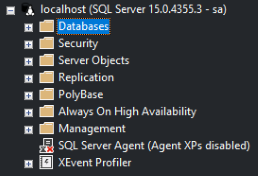
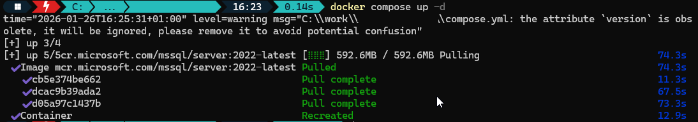
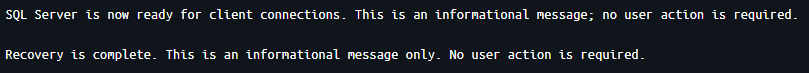

## Containerben futó SQL Server migrálása

Eljött az idő a helyben, konténerben futtatott SQL Serverem újabb verzióra való migrálására. Szerencsére ez nem nagy dolog: gyorsan meg lehet csinálni.

### Kiindulás

Én eddig SQL Server 2019-et használtam, ezt fogjuk migrálni.



A docker compose fájlom így nézett ki:

``` yaml
version: '3.9'
services:
  sqlserver:
    image: mcr.microsoft.com/mssql/server:2019-latest
    cpus: 2.0
    mem_limit: 4G
    container_name: sqllocal
    environment:
      - SA_PASSWORD=yourPassword
      - ACCEPT_EULA=Y
    ports:
      - "1433:1433"
    volumes:
      - C:\work\SQL\data:/var/opt/mssql/data
      - C:\work\SQL\backup:/var/opt/mssql/backup
    network_mode: bridge
``` 

Mivel a `data` mappám eleve hozzá van csatolva (bind mount) a Windows fájlrendszerem egyik könyvtárához, ezért viszonylag könnyű dolgom van.

### Migrálás

Elsőként (és talán ez a legfontosabb) készítettem egy biztonsági mentést a teljes `C:\work\SQL` mappáról arra az esetre, ha bármi probléma történne.
Ezután átírtam a docker compose fájlomat, hogy az SQL Server 2022 latest image-t használja:

``` yaml
version: '3.9'
services:
  sqlserver:
    image: mcr.microsoft.com/mssql/server:2022-latest
    cpus: 2.0
    mem_limit: 4G
    container_name: sqllocal
    environment:
      - SA_PASSWORD=yourPassword
      - ACCEPT_EULA=Y
    ports:
      - "1433:1433"
    volumes:
      - C:\work\SQL\data:/var/opt/mssql/data
      - C:\work\SQL\backup:/var/opt/mssql/backup
    network_mode: bridge
``` 

A következő lépésben már indíthattam és nézhettem, mi történik. A terminálban a `compose.yml` mappájába navigáltam, majd kiadtam az alábbi parancsot (a down csak akkor kell, ha még fut a container):

``` bash
docker compose down
docker compose up -d
```



A konténer logjában különböző upgrade üzenetek jelennek meg, majd amikor végzett a migrációval, látható volt, hogy készen áll a kapcsolatok fogadására.



Végül ellenőriztem, hogy tudok kapcsolódni a szerverhez és minden ugyanúgy működik, mint eddig.

  

### Amit még érdemes megemlíteni

- A 2022-re frissített adatfájlokkal a 2019-es SQL Server konténer már nem fog elindulni.
- A régi adatbázisok kompatibilitási szintje maradt a régi `SQL Server 2019 (150)`
  


- Amennyiben nincs perzisztens tárolás, akkor lehet érdemes felcsatolni egy volume-t, vagy backup/restore megoldást használni.
- A compose fájlt is lehet modernizálni, ez egy régebben írt compose fájl (pl.: version kivétele, vagy env fájl használata)
