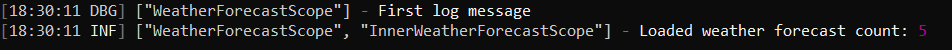
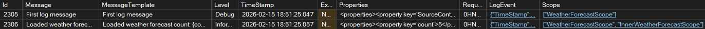

## Serilog és az ILogger Scope

A BeginScope metódus segítségével hozhatunk létre egy 

``` csharp
app.MapGet("/weatherforecast", (ILogger<Program> logger) =>
{
    var forecast = Enumerable.Range(1, 5).Select(index =>
        new WeatherForecast
        (
            DateOnly.FromDateTime(DateTime.Now.AddDays(index)),
            Random.Shared.Next(-20, 55),
            summaries[Random.Shared.Next(summaries.Length)]
        ))
        .ToArray();

    using IDisposable? loggerScope = logger.BeginScope("WeatherForecastScope");
    logger.LogDebug("First log message");

    using IDisposable? innerLoggerScope = logger.BeginScope("InnerWeatherForecastScope");
    logger.LogInformation("Loaded weather forecast count: {count}", forecast.Length);

    return forecast;
})
.WithName("GetWeatherForecast");
```

``` xml
<properties>
<!-- ... -->
    <property key='Scope'>
        <sequence>
            <item>WeatherForecastScope</item>
        </sequence>
    </property>
<!-- ... -->
</properties>
```

``` xml
<properties>
<!-- ... -->
    <property key='Scope'>
        <sequence>
            <item>WeatherForecastScope</item>
            <item>InnerWeatherForecastScope</item>
        </sequence>
    </property>
<!-- ... -->
</properties>
```

``` json
{
  "TimeStamp": "2026-02-15T18:51:25.0577241",
  "Level": "Information",
  "Message": "Loaded weather forecast count: 5",
  "MessageTemplate": "Loaded weather forecast count: {count}",
  "Properties": {
    "count": 5,
    "SourceContext": "Program",
    "RequestId": "0HNJCNB84BNEC:00000003",
    "RequestPath": "/weatherforecast",
    "ConnectionId": "0HNJCNB84BNEC",
    "Scope": [
      "WeatherForecastScope",
      "InnerWeatherForecastScope"
    ]
  }
}
```



``` sql
ALTER TABLE dbo.Logs 
ADD Scope nvarchar(MAX) NULL
```

``` json
[
  "WeatherForecastScope",
  "InnerWeatherForecastScope"
]
```

``` json
"Serilog": {
  "Using": [
    "Serilog.Sinks.Console",
    "Serilog.Sinks.MSSqlServer"
  ],
  "MinimumLevel": {
    "Default": "Debug",
    "Override": {
      "Microsoft.AspNetCore": "Warning",
      "System": "Warning"
    }
  },
  "WriteTo": [
    {
      "Name": "Console",
      "Args": {
        "outputTemplate": "[{Timestamp:HH:mm:ss} {Level:u3}] {Scope} - {Message}{NewLine}{Exception}"
      }
    },
    {
      "Name": "MSSqlServer",
      "Args": {
        "connectionString": "LogDbConnectionString",
        "sinkOptionsSection": {
          "tableName": "Logs"
        },
        "columnOptionsSection": {
          "addStandardColumns": [
            "LogEvent"
          ],
          "additionalColumns": [
            {
              "ColumnName": "RequestId",
              "DataType": "nvarchar",
              "DataLength": 36
            },
            {
              "ColumnName": "Scope",
              "DataType": "nvarchar",
              "DataLength": -1
            }
          ]
        }
      }
    }
  ]
}
```


